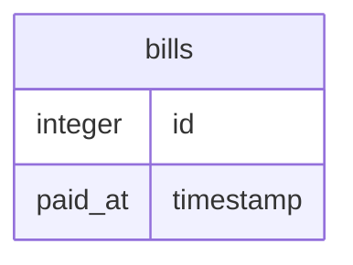

# 行の排他ロックを試してみる

## テーブル構成

外部 API を呼び出して決済完了時点で paid_at に現在時刻を入れます。



## 事前準備

- シードスクリプトの挿入

シードスクリプトを実行します。bills のレコードが id 0-9 までの 10 件生成されます。
再度シードスクリプトを実行すると、再度レコードの生成が行われます。

## 手順

```bash
go run ./pessimistic/seed/main.go
```

- 請求スクリプトの実行

請求スクリプトを実行します(スクリプトA)。
bills のレコードの読み込みが完了し決済 API が呼び出されます( 標準入力を待つことで擬似的な外部 API 呼び出しとしています )。

```bash
go run ./pessimistic/payment/lock/main.go [0-9 のいずれか]
```

新規タブ(ターミナル)で同じスクリプトを同じ引数で実行します(スクリプトB)。
スクリプトAで実行されているトランザクションによって bills のレコードの排他ロックが取られているので、スクリプトBでは読み込みがブロックされることが確認できると思います。

スクリプトAで Enter を押下すると決済処理が完了します。
その時、スクリプトBでは決済処理が行われず、決済済の表示が行われることが確認できると思います。

## おまけ. 不整合が起きるケースを試す手順

- 請求スクリプトの実行

請求スクリプトを実行します(スクリプトA)。
上記スクリプトと同じく bills のレコードの読み込みが完了し決済 API が呼び出されます( 標準入力を待つことで擬似的な外部 API 呼び出しとしています )。

```bash
go run ./pessimistic/payment/nolock/main.go [0-9 のいずれか]
```

新規タブ(ターミナル)で同じスクリプトを同じ引数で実行します(スクリプトB)。
スクリプトAで実行されているトランザクションは bills のレコードの排他ロックを取っていないので、スクリプトBでも読み込みが完了し、そのまま決済処理が行われます。
