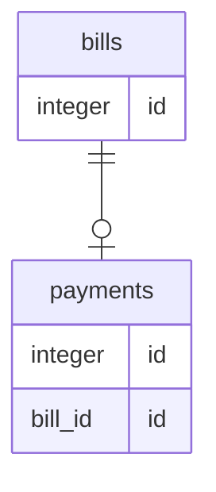

# UNIQUE 制約を試してみる

### テーブル構成

外部 API を呼び出して決済完了時点で bills に対して payments のレコードが作成されます。


```mermaid
erDiagram

bills {
  integer id
}

payments {
    integer id
    bill_id id
}

bills ||--o| payments: ""
```

## 手順

シードデータを入れます。

```bash
go run ./uniq/seed/main.go
```
